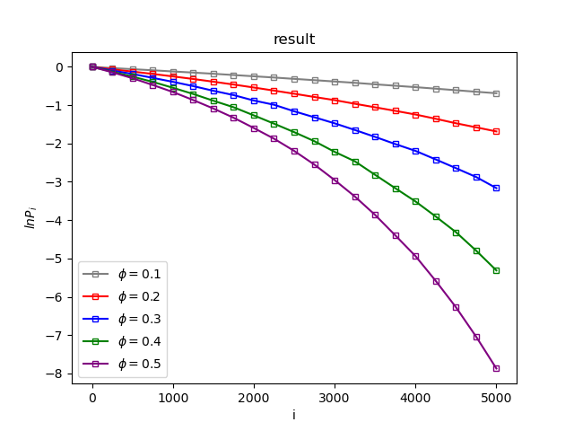
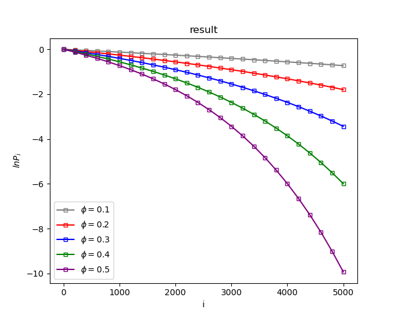

Reproduction of an article
>YANG Y, WAN D. A geometry-originated universal relation for arbitrary convex hard particles[A/OL]. arXiv, 2023. https://arxiv.org/abs/2310.10551. DOI:10.48550/ARXIV.2310.10551.

gsd files need to be created by using the corelated gsd generate files.

some rusults.

